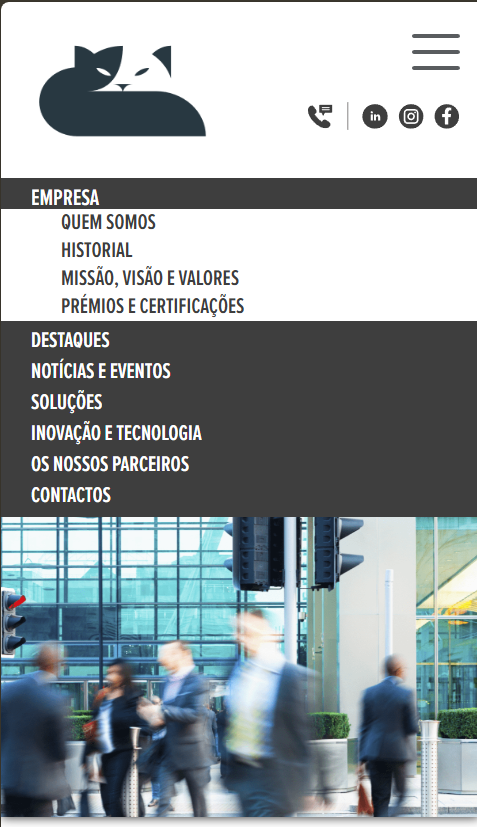
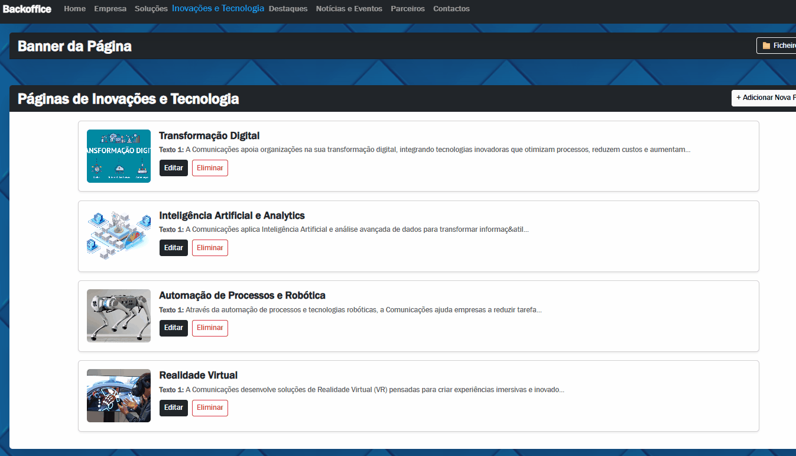
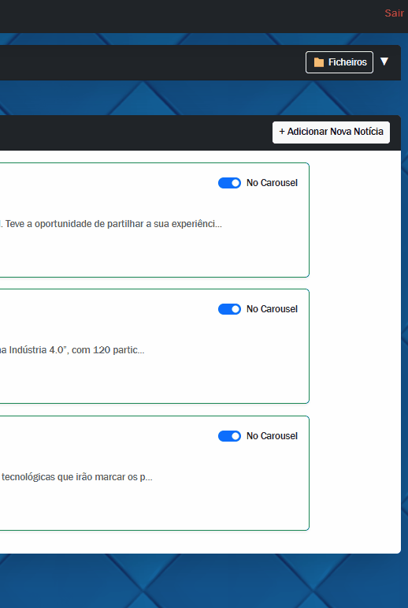

# PHP CMS Platform

Demo funcional de um CMS genérico de notícias e destaques de uma empresa. Serve como portfólio para demonstrar competências em PHP, MySQL, Bootstrap e JavaScript.

---

## 🔗 Site Live
[Ver site online](https://ccdev.free.nf)
[Ver backoffice online](https://ccdev.free.nf/backoffice)

---

## 🛠 Tecnologias Utilizadas
- **PHP** – Backend dinâmico  
- **MySQL** – Base de dados, ligação via phpMyAdmin  
- **Bootstrap** – Layout responsivo  
- **JavaScript** – Funcionalidades interativas  
- **TinyMCE** – Editor de conteúdo rico  
- **HTML / CSS** – Estrutura e estilo do frontend  

---

## ⚙ Funcionalidades Principais
- Backoffice com login demo (`demo/demo`)  
- CRUD de notícias e fotos  
- Editor TinyMCE para criar e editar conteúdo  
- Proteções implementadas: hash de passwords, prevenção contra SQL injection  
- Frontend dinâmico baseado em PHP + Bootstrap + JS  

---

## 📸 Screenshots / GIFs

Frontend do site (clicar para expandir)

  
  

Backoffice – login / editor (clicar para expandir)

  

---

## 📝 Observações
- Projeto funcional, destinado a portfólio / demo.  
- Credenciais demo estão visíveis na página de login.  
- Ideal para mostrar arquitetura, boas práticas e segurança mínima em projetos web.
